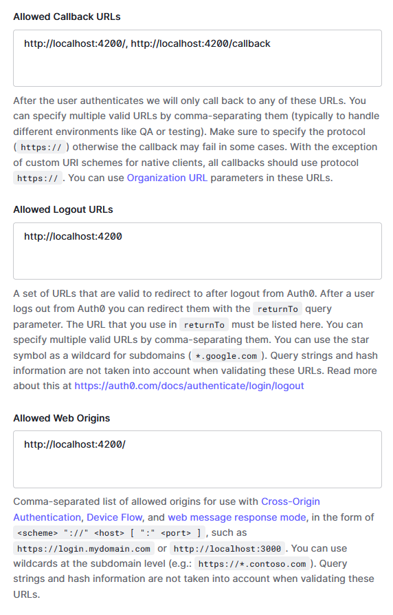

# Angular Authentication: Auth0

A simple example that shows how to use [Angular](https://angular.io/) with [Auth0](https://auth0.com)

## Setup

* Create an account at Auth0 (https://auth0.com)
* Add your endpoints to your client's allowed urls like this:
  

* Copy the file `.environment.example` in the environments folder, rename it as `.environment` and add your Auth0 keys
 
## Running Locally

```
git clone https://github.com/nuxt/example-auth0.git
cd example-auth0
npm install
ng serve
```

Navigate to `http://localhost:4200/`. The application will automatically reload if you change any of the source files.
